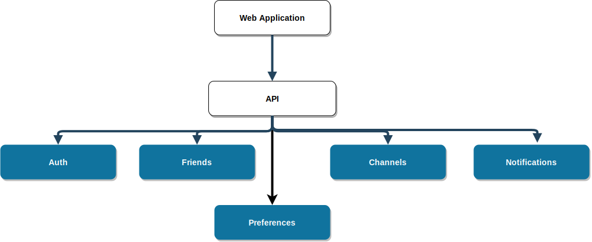
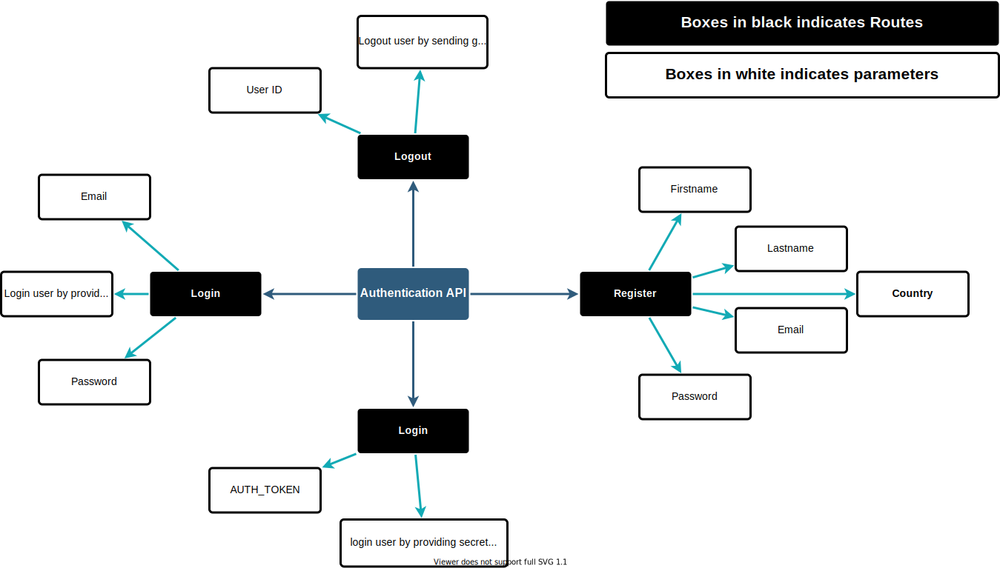
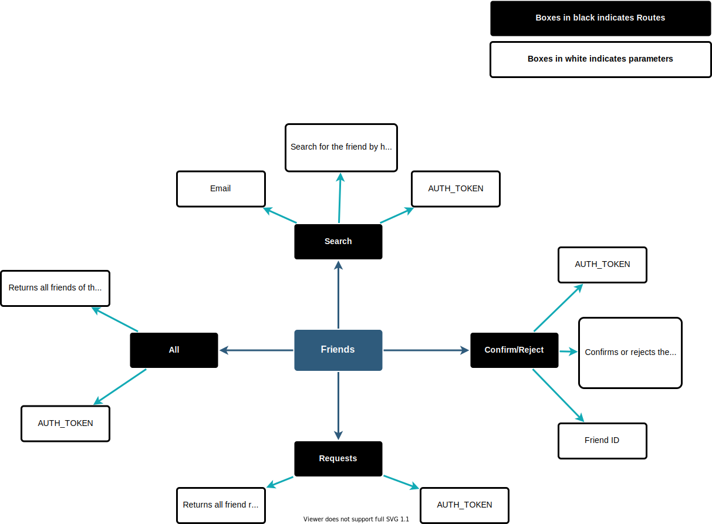
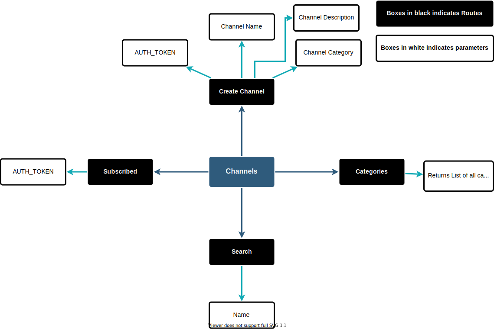

## Working of application

The above diagram describes chat application. The diagram should understood as follows:

### Top Level Module

| Component | Description |
| -------- | ---------- |
| Web Application | The user interface, to display data. This component does not have direct access to application. |
| API | This part of the application provides data to display. It further is divided into several components, where each sub component is responsible for specific data. |

### API Sub Modules

| Component | Description |
|--------- | ----------- |
| Auth		| Handles login, and register routes, also checks if user is online or offline |
| Friends | Provides data about user friends. |
| Preferences | Provides user preferences data |
| Channels | Provides data about subscribed channels, and also feature to search new channels. |
| Notifications | Provides notifications data for the required user. |

## Auth Module

There are two types of authentication system supported by the application:

- Authentication via (Email and Password)
- Authentication via (AUTH_TOKEN)

The idea behind this module is that:

- The application boots to login screen.
- The login screen, checks if user is logged in.
	- If user is logged in, (check credentials via ajax request)
	- Else prompt user for login

The routes in the api are:

|	Route 						| Method  	|	Description 			 |
| ----------------------------  | ------- 	| -------------------------- |
| /auth/login/ 					| POST		| Login user by a secret key |
| /auth/login 		|			| POST 		| Login user by credentials  |
| /auth/check/<user_id> 		| GET 		| Check if the user is online or offline |
| /auth/logout/					| POST		| Logout user by a secret key |

> Secret key will be provided in headers as **AUTH_TOKEN** parameter.

## Friends Module

The Module will be responsible to serve data related:

- All User friends
- Friend Requests send and received by the user.
- Accept or reject friend request.
- Chat with existing friends.

The routes of the api are:

|	Route 						| Method  	|	Description 			 |
| ----------------------------  | ------- 	| -------------------------- |
| /friends/all/ 				| POST		| Returns all friends of the user. User has to provide secret key in headers of the request. |
| /friends/requests 			| POST 		| View all friend requests sent to the user.  |
| /friends/confirm/<friend_id>  | POST 		| Accepts friend request of the user. |
| /friends/reject/<friend_id>   | POST 		| Rejects friend request of the user. |
| /friends/search/<email_id>	| POST		| Searches friend by his email id. |
| /friends/chats/<friend_id>	| POST		| Get all chats between user and friend. |

> All the above post requests of the friends module requires you to pass **AUTH_TOKEN** in the headers. **AUTH_TOKEN** is referred to as secret key in the documentation.

## Channels Module

The module will be responsible for serving data realated to:

- All channels subscribed by the user.
- Searching public channels.
- Create new channel.
- Chat on available channels.
- Return categories related to the channels.

The routes of the api are:

|	Route 						| Method  	|	Description 			 |
| ----------------------------  | ------- 	| -------------------------- |
| /channels/subscribed/ 		| POST		| Returns all subscribed channels of the user. User has to provide secret key in headers of the request. |
| /channels/create 				| POST 		| Create new channel.  |
| /channels/search/<name>  		| POST 		| Search channel by its name. |
| /channels/chats/public/<channel_id>  | POST 		| Get chat messages for the channel |
| /channels/chats/send/<channel_id> 			| POST 		| Sends message on a channel.

## Issues
- **ISSUE**: Automatically change status to offline, after every 30 seconds. 
- **FIX**: Client will change its status to online after every 30 seconds.